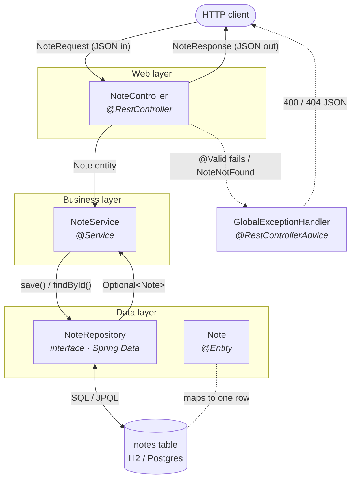

# OOP & Constructors — Why These Are Classes

> Personal OOP refresher, grounded in *this* repo's code. Companion to
> `classes-vs-functions.md` in the **defense-news-classifier** repo, which shows the *other*
> half: where plain functions are the right call. The lesson is the contrast — that project's
> generator has no state to hold, so it's functions; the code here has long-lived things with
> rules to protect, so it's classes.

## The one idea (mirror image of the Python note)

You reach for a class when you have **state worth keeping + invariants to protect + behavior
bound to that state**. The notes API has all three, everywhere:

- A `Note` is a *thing* with identity and fields that must stay valid (title/content never null).
- A `NoteService` *holds* its repository dependency and owns the business rules.
- Each layer is a distinct **responsibility**, and a class is how you name a responsibility.

## Why classes: the layered architecture *is* the class list

A request flows down one class per layer and back. The class boundaries are the design:

| Class | Responsibility (its one job) |
|---|---|
| `NoteController` | HTTP edge — speaks DTOs, never lets the entity leak out |
| `NoteService` | business rules — "404 when missing", "update is read-modify-write" |
| `NoteRepository` | data access — talking to the database |
| `Note` | the domain thing being stored (one instance = one row) |
| `NoteRequest` / `NoteResponse` | the API contract, kept separate from the DB shape |

Split this way, each rule lives in exactly one place. That's the whole payoff of "why
classes": **separation of concerns you can point at.**

### How they interact



Two arrow styles, two different things:

- **Solid arrows = the request flow at runtime** — data going down the layers and back up.
- **The wiring (who *holds* whom) runs the other way and is set once at startup:**
  `NoteController` holds a `NoteService`, which holds a `NoteRepository` — each handed in
  through its **constructor** (see below). Read the solid arrows for "what calls what," and
  the constructor section for "what was assembled into what."

## Constructors (ctors) — the heart of it

**What a constructor is:** the setup ritual that runs when you create an object
(`new Note(...)`). **What it's for:** leave the new object in a *valid, ready-to-use* state —
so nobody can get their hands on a half-built one.

### `Note` has *two* constructors, on purpose ([`Note.java`](../../src/main/java/com/notes/api/model/Note.java))

```java
protected Note() { }                        // (1) for JPA/Hibernate only

public Note(String title, String content) { // (2) for our own code
    this.title = title;
    this.content = content;
}
```

- **(1) The no-arg ctor** exists because JPA builds entities by reflection when reading DB
  rows — it needs to call `new Note()` then fill fields in. It's `protected` to discourage
  *your* code from making a blank, invalid note.
- **(2) The convenience ctor** is the one *you* call. It demands the two things a note can't
  exist without. There's deliberately no way to construct a `Note` with no title — the ctor
  is the gatekeeper of "what valid means."

> This is exactly the Python note's `@dataclass Article(...)` point: the generated `__init__`
> refuses to build an object missing required fields. Same job, same "why."

### Constructor injection — the *other* reason ctors matter ([`NoteService.java`](../../src/main/java/com/notes/api/service/NoteService.java))

```java
private final NoteRepository repository;

public NoteService(NoteRepository repository) {   // Spring supplies it here
    this.repository = repository;
}
```

The ctor isn't just setting a field — it's **stating a dependency**. A `NoteService` *cannot
exist* without a repository, and Spring sees the single ctor and injects one automatically.
Two payoffs:

1. The field is `final` — set once at birth, never reassigned, can't be null afterward.
2. It's trivially testable: `new NoteService(mockRepo)` — no Spring container needed.

> This is the Python note's `DatasetGenerator.__init__(self, client)` idea made real: hand the
> dependency in once at construction instead of threading it through every call.

## The four pillars, one example each

- **Encapsulation** — `Note` keeps fields `private` and exposes getters/setters, so it can
  enforce rules on the way in. See `setTags`: it makes a **defensive copy** and treats `null`
  as "empty", so the field is *never* null and outside code can't mutate the internal set.
  (≈ a Python property setter.)
- **Abstraction** — `NoteRepository` is just an **interface**
  ([`NoteRepository.java`](../../src/main/java/com/notes/api/repository/NoteRepository.java)).
  You call `findById(id)` / `save(note)` and never see the SQL; Spring Data generates the
  implementation at startup. You program to *what*, not *how*.
- **Inheritance** — `interface NoteRepository extends JpaRepository<Note, Long>` inherits
  `save`, `findById`, `findAll`, `deleteById`, … for free. Inheritance here is **reuse of a
  ready-made contract**, not a deep class tree.
- **Polymorphism** — `NoteService` depends on the `NoteRepository` *interface*, not a concrete
  class. In production Spring injects the generated impl; in a unit test you inject a mock.
  **Same call site, different object behind it** — that's polymorphism doing real work, and
  it's *why* abstraction pays off.

## DTOs: encapsulation at the API boundary ([`NoteRequest.java`](../../src/main/java/com/notes/api/dto/NoteRequest.java))

```java
public record NoteRequest(@NotBlank String title, @NotBlank String content, Set<String> tags) { }
```

A `record` is an **immutable data carrier** — the compiler writes the ctor, accessors,
`equals`/`hashCode`, `toString`. Closest Python analogy: a **frozen `@dataclass`** (this is
the exact mirror of the Python note's `Article`). The sharp design point: `NoteRequest` has
**no `id` / `createdAt` / `updatedAt`** — so a client literally has no field to set those
server-controlled values with. The shape of the class *is* the security boundary.

## TL;DR

| Question | Answer | Seen in |
|---|---|---|
| Why classes here | Long-lived things with state + rules + bound behavior; one class per responsibility | the layer table |
| What a ctor is *for* | Leave the object valid & ready — gatekeeper of "valid" | `Note(title, content)` |
| Why two ctors on `Note` | No-arg for JPA reflection; convenience one for your code | `Note.java` |
| Why ctors beyond setting fields | **Constructor injection** — declare a required dependency, make it `final` + testable | `NoteService(repo)` |
| Encapsulation | private fields + defensive copy in `setTags` | `Note.java` |
| Abstraction / Polymorphism | depend on the `NoteRepository` *interface*; swap impl ↔ mock | `NoteService` + `NoteRepository` |
| Record ≈ frozen dataclass | immutable DTO; omitting `id` blocks client from setting it | `NoteRequest.java` |
